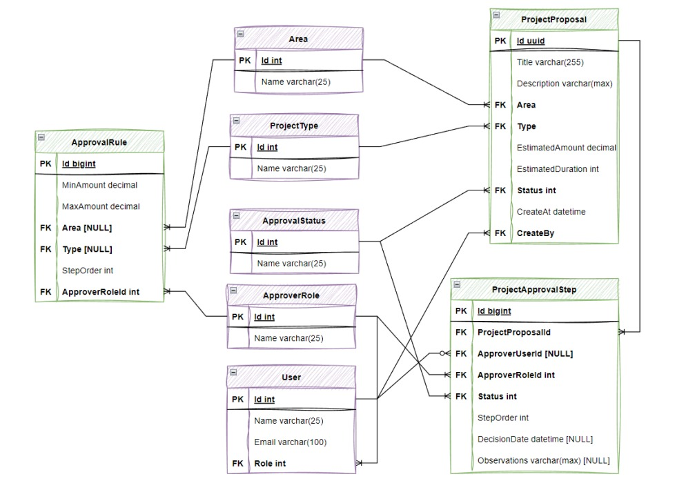



# Aprobación de Proyectos - Aplicación de Consola - TP1

Este proyecto es una aplicación de consola desarrollada en C# para la materia 'Proyecto de Software', que permite crear solicitudes de proyectos y gestionar su aprobación de forma dinámica, según reglas preestablecidas.

---

## Características

Se implementan las características pedidas en el trabajo, tales como:

1. Crear solicitudes de proyectos con datos como área, tipo y monto estimado.
2. Generación automática del flujo de aprobación basado en reglas preestablecidas.
3. Validación del orden de aprobación y del usuario autorizado.
4. Visualización del estado actual de la solicitud y sus pasos de aprobación.
5. Rechazo o aprobación de cada paso.
6. Registro de auditoría de cada acción realizada en la solicitud.
7. Generación de reportes de auditoría.
8. Interfaz de usuario amigable y fácil de usar.

---

## Tecnologías utilizadas

Se utilizó las siguientes tecnologías para el desarrollo de la aplicación:

- Lenguaje:  C# (.NET 8)
- IDE: Visual Studio 2022
- Base de datos: SQL Server (LocalDB)
- ORM: Entity Framework Core

---

## Arquitectura del Proyecto

La aplicación sigue el patrón de **Clean Architecture** y está dividida en cuatro capas, separando responsabilidades claras:

- **Domain**: Contiene las entidades del modelo, directamente relacionadas con el DER.
- **Application**: Define interfaces y servicios con la lógica de negocio.
- **Infrastructure**: Incluye la configuración del contexto (`DbContext`), migraciones, seeders y repositorios.
- **Presentation**: Contiene la lógica de consola y sus helpers (validaciones, printers, etc.).

Además se implementa los principios **SOLID** y **Clean Code**, para mantener un código mantenible, extensible y fácil de testear.

---

## Base de datos

La base de datos se contruye automáticamente al iniciar la aplicación, utilizando el patrón Code First en Entity Framework Core, y aplicando las migraciones necesarias para crear las tablas y relaciones según el Diagrama Entidad-Relación (DER) proporcionado.

- Se utiliza SQL Server LocalDB para el desarrollo y pruebas.
- Se usa el ORM Entity Framework Core.
- Los datos iniciales se cargan automáticamente mediante seeders.
- La estructura de la base de datos respeta el DER brindado.
- Las migraciones necesarias se aplican automáticamente.
- Se utiliza el patrón **Repository** para la persistencia de datos.

---

## Diagrama Entidad-Relación (DER):

---

## Ejecución de la aplicación

1. Abrir el proyecto en Visual Studio.
2. Iniciar la aplicación (F5 o dotnet run).
3. Al iniciar, se generará la base de datos automáticamente, aplicando las migraciones necesarias.
4. Aparecerá un menú interactivo en consola para crear solicitudes de proyectos, gestionar su aprobación y generar reportes de auditoría.
5. Seguir las instrucciones en pantalla para interactuar con la aplicación según la opción seleccionada.
   - Para crear un nuevo proyecto, seleccionar la opción correspondiente y completar los datos requeridos.
   - Para gestionar los pasos de aprobación de un proyecto, seleccionar la opción correspondiente y seguir las instrucciones para aprobar o rechazar cada paso.
   - Para  ver el estado actual de un proyecto, seleccionar la opción correspondiente y seguir las instrucciones para elegir la propuesta a auditar.
6. Para salir de la aplicación, seleccionar la opción correspondiente en el menú.

---

## Autor

- Nombre: Diaz Federico
- Año: 2025
- Materia: Proyecto de Software
- Universidad Nacional Arturo Jauretche

---

## Notas

- Este proyecto es un trabajo académico. 
- Puede ser extendido para una versión web o móvil. 
